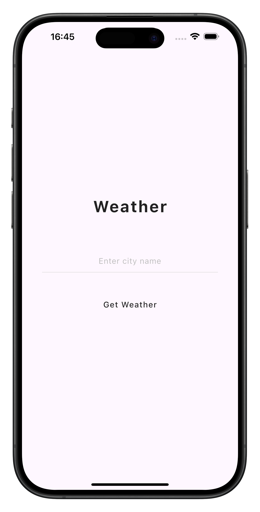
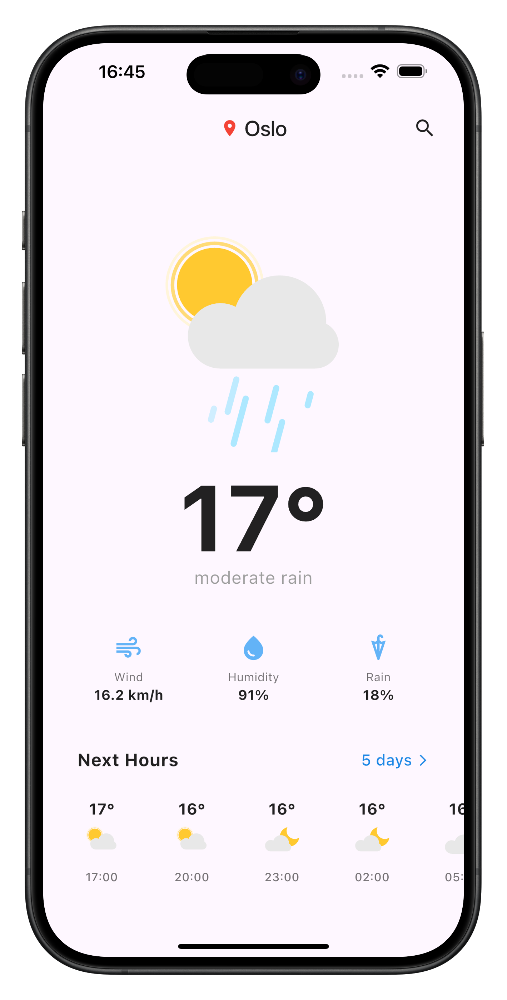

# Weather App 🌤️

A modern, responsive Flutter weather application with elegant animations, 5-day forecasts, and professional architecture.

## ✨ Features

- **Real-time Weather Data**: Integration with OpenWeatherMap API
- **Lottie Animations**: Beautiful weather animations with 13 custom weather states
- **3-Hour Forecast**: Horizontal scrolling hourly weather predictions
- **5-Day Forecast**: Dedicated page with detailed daily weather overview
- **Professional UI**: Minimalist design with optimized spacing and typography
- **Responsive Design**: Optimized for different screen sizes with overflow protection
- **Clean Architecture**: Well-organized code structure with separation of concerns
- **Modern Navigation**: Smooth page transitions and intuitive user flow

## 📸 Screenshots

<div align="center">
  <h3>🔍 Search Screen</h3>
  
  <p><em>Minimalist search interface with clean typography</em></p>
</div>

<div align="center">
  <h3>🌤️ Main Weather Screen</h3>
  
  <p><em>Current weather with Lottie animations and 3-hour forecast</em></p>
</div>

<div align="center">
  <h3>📅 5-Day Forecast Screen</h3>
  
  <p><em>Tomorrow highlight and extended daily forecast</em></p>
</div>

---

## 🏗️ Architecture

```
lib/
├── constants/          # App-wide constants and styling
│   └── app_styles.dart # Colors, fonts, dimensions, animations
├── models/            # Data models  
│   ├── weather_model.dart    # Current weather data
│   └── forecast_model.dart   # 3-hour forecast data with extended fields
├── pages/             # Screen/page widgets
│   ├── weather_page.dart         # Main weather screen
│   └── daily_forecast_page.dart  # 5-day forecast screen
├── services/          # External API services
│   ├── weather_service.dart   # Current weather API
│   └── forecast_service.dart  # 5-day forecast API
├── utils/             # Helper functions and utilities
│   └── weather_utils.dart    # Conversions, formatting, Lottie mapping
├── widgets/           # Reusable UI components
│   ├── city_search_widget.dart      # Minimalist search form
│   ├── weather_app_bar.dart         # Custom app bar with location
│   ├── weather_display.dart         # Main weather view + 3hr forecast
│   ├── weather_info_card.dart       # Individual info cards
│   ├── hourly_forecast_widget.dart  # "Next Hours" horizontal list
│   └── forecast_item_widget.dart    # Individual forecast cards
├── assets/            # Lottie animation files
│   ├── broken_clouds.json
│   ├── clear_day.json
│   ├── clear_night.json
│   ├── few_clouds_day.json
│   ├── few_clouds_night.json
│   ├── mist.json
│   ├── rain_day.json
│   ├── rain_night.json
│   ├── scattered_clouds.json
│   ├── shower_rain_night.json
│   ├── shower_rain.json
│   ├── snow.json
│   └── thunderstorm.json
└── main.dart          # App entry point
```

## 🎨 Design Features

- **Lottie Animations**: 13 custom weather animations with smart icon mapping
- **Animation Control**: Strategic use of `repeat: false` for static vs dynamic icons
- **Minimalist UI**: Clean typography, subtle colors, optimal spacing
- **Professional Layout**: Cards, proper hierarchy, responsive overflow handling
- **Consistent Theming**: Centralized styling in `AppStyles`
- **Smart Navigation**: Contextual buttons with intuitive flow

## 🔧 Technical Implementation

### Core Systems
- **Lottie Animations**: 13 weather-specific JSON animations with smart OpenWeatherMap icon mapping
- **Dual APIs**: Current weather + 5-day forecast with data aggregation and error handling  
- **Professional UI**: Overflow protection, responsive design, consistent loading states
- **Navigation**: StatefulWidget state management with MaterialPageRoute transitions

## 📦 Dependencies

```yaml
dependencies:
  flutter:
    sdk: flutter
  http: ^1.1.0         # HTTP requests for API calls
  lottie: ^3.1.2       # Lottie animations for weather icons
  cupertino_icons: ^1.0.2

dev_dependencies:
  flutter_test:
    sdk: flutter
  flutter_lints: ^3.0.0
```

## 🚀 Getting Started

### Prerequisites
- Flutter SDK (>=3.0.0)
- Dart SDK (>=3.0.0)  
- OpenWeatherMap API key

### Installation

1. **Clone the repository**
   ```bash
   git clone https://github.com/tloxiu/flutter_weather_app.git
   cd flutter_weather_app
   ```

2. **Install dependencies**
   ```bash
   flutter pub get
   ```

3. **Configure API key**
   - Get your free API key from [OpenWeatherMap](https://openweathermap.org/api)
   - Update API key in both service files:
     - `lib/services/weather_service.dart`
     - `lib/services/forecast_service.dart`
   ```dart
   static const String _apiKey = 'YOUR_API_KEY_HERE';
   ```

4. **Run the application**
   ```bash
   flutter run
   ```

## 🌟 Key Components

### Data Models & Services
- **WeatherModel**: Current weather with temperature, wind, humidity, rain
- **ForecastItem**: Extended 3-hour forecast data with all weather parameters  
- **WeatherService & ForecastService**: API integration with error handling and data processing

### Professional Utilities & UI
- **WeatherUtils**: Unit conversions, formatting, Lottie animation mapping for 13 weather states
- **AppStyles**: Complete styling system with colors, fonts, animations
- **Component System**: Reusable widgets for weather display, forecasts, search, and info cards

## 🎯 App Navigation Flow

1. **Start**: Minimalist search screen with "Weather" title
2. **Search**: Enter city → Loading indicator → Weather data
3. **Main View**: Current weather + 3-hour forecast with "5 days" button  
4. **5-Day Forecast**: Tomorrow highlight + 4 additional days list
5. **Return**: Back button to main weather screen

## 👏 Acknowledgments

- [OpenWeatherMap](https://openweathermap.org/) for comprehensive weather data API
- [LottieFiles](https://lottiefiles.com/) community for weather animation inspiration
- [Flutter](https://flutter.dev/) for the amazing cross-platform framework
- [Material Design](https://material.io/) for professional design guidelines

---

**Repository**: [flutter_weather_app](https://github.com/tloxiu/flutter_weather_app)  
**Version**: 2.0.0  
**Flutter**: 3.x  
**Dart**: 3.x  

Made with ❤️
